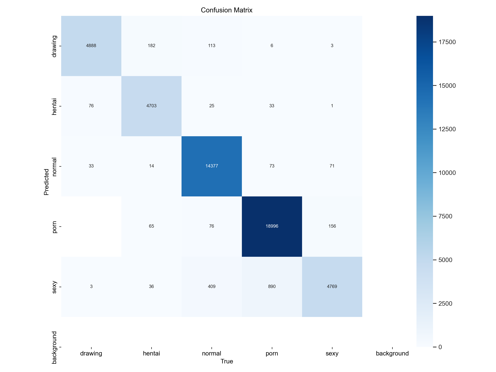
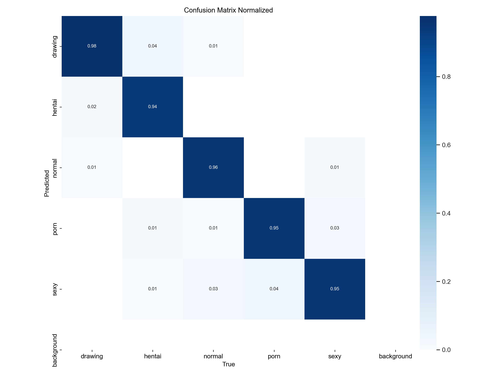
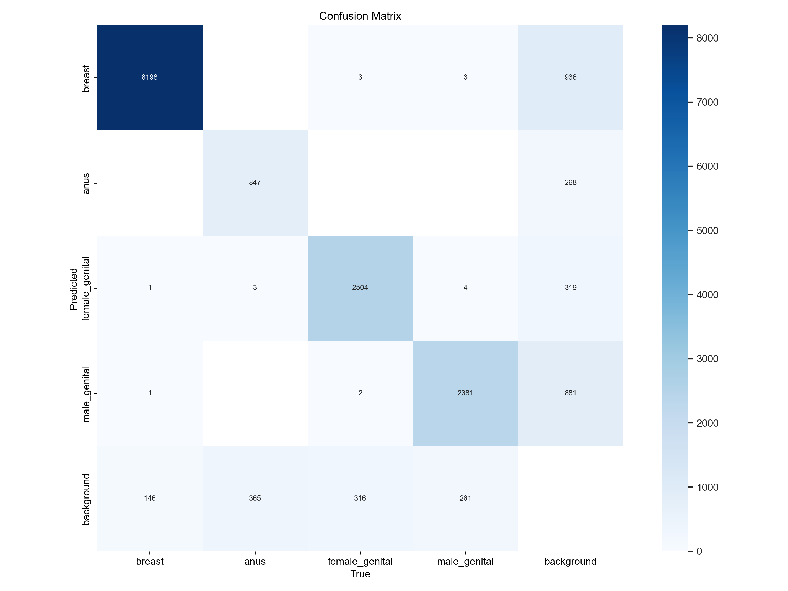
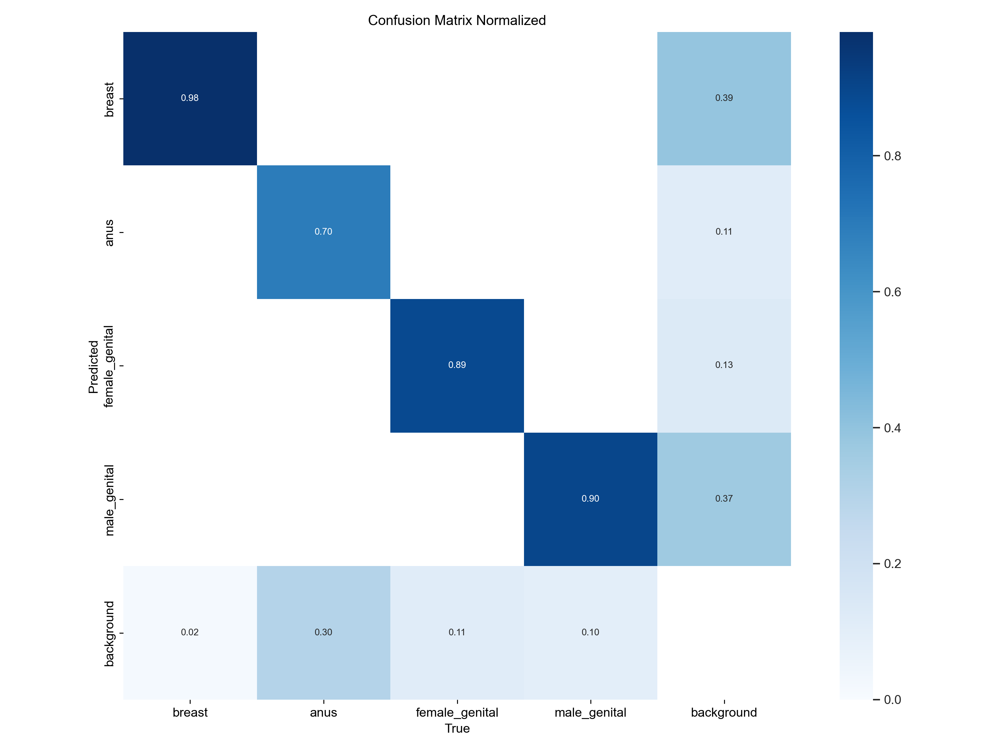

# NSFW Detector & Annotator


A Streamlit-based web application for detecting, classifying, and blurring explicit content in images using YOLO models.

---

## Table of Contents

- [Overview](#overview)
- [Features](#features)
- [Project Structure](#project-structure)
- [Installation](#installation)
- [Usage](#usage)
- [Models](#models)
- [Results](#results)
- [Future Plans](#future-plans)
- [License](#license)
- [Contributing](#contributing)
- [Citations](#citations)
- [Contact](#contact)

---

## Overview

The **NSFW Detector & Annotator** is a tool designed to classify images into categories such as `drawing`, `hentai`, `normal`, `porn`, and `sexy`. It also detects explicit regions in images and allows users to blur them for moderation purposes. The app is built using **Streamlit** and leverages **YOLO (You Only Look Once)** models for classification and segmentation. Support for videos has been added wherein the user can upload a videa and the model will process it and return the annotated video once done.

---

## Features

- **Image Classification**: Classifies images into 5 categories: `drawing`, `hentai`, `normal`, `porn`, and `sexy`.
- **Explicit Region Detection**: Identifies explicit regions within images by utilizing a segmentation model trained to detect areas such as `breast`, `anus`, `female_genital`, and `male_genital`.
- **Blurring**: Allows users to blur detected explicit regions with adjustable blur intensity.
- **Video Moderation**: Identifies and blurs explicit regions in each frame.
- **Interactive UI**: Built with Streamlit for a user-friendly and interactive experience.

---

## Project Structure

The project is organized as follows:

```
nsfw-detector-annotator/
├── models/
│   ├── classification_model.pt
│   └── segmentation_model.pt
├── scripts/
│   ├── train_classification.py
│   └── train_segmentation.py
├── assets/
│   ├── classification/
│   ├── confusion_matrix.png
│   └── confusion_matrix_normalized.png
│   └── segmentation/
│   ├── confusion_matrix.png
│   └── confusion_matrix_normalized.png
├── app/
│   ├── app.py
│   ├── admin.py
│   └── utils.py
├── requirements.txt
└── README.md
```

---

## Installation

1. **Clone the Repository**:
   ```bash
   git clone https://github.com/Forenche/nsfw_detector_annotator.git
   cd nsfw_detector_annotator

2. **Set Up a Virtual Environment** (Optional but Recommended):
    ```bash
    python -m venv venv
    source venv/bin/activate  # On Windows: venv\Scripts\activate

3. **Install Dependencies**:
    ```bash
    pip install -r requirements.txt

---


## Usage

1. **Run the Streamlit App**:
    ```bash
    streamlit run app/app.py

2. **Upload Image(s) or Videos**:
    
    * Use the file uploader to upload a batch of images or a single image.
    * Switch to video mode and use the file uploader to upload a video to blur explicit regions.

3. **View Results**:

    * The app will classify the image and display the result.
    * If the image is classified as `porn` or `hentai`, explicit regions will be detected and can be blurred.
    * Use the "Blur NSFW Regions" checkbox to toggle blurring on the detected regions.
    * The video will have the explicit regions blurred out once processed.

4. **Adjust Blur Intensity**:

    * Use the slider to adjust the blur intensity.

---

## Models
The app uses two YOLO models:

1. **Classification Model** (classification_model.pt):

    * Classifies images into one of the 5 classes.

2. **Segmentation Model** (segmentation_model.pt):

    * Detects, segments and blurs explicit regions in images.

---

## Results

For the classification model:


| Confusion Matrix       | Normalized Confusion Matrix       |
|---------------------------------------|-----------------------------------|
|  |  |


For the segmentation model:
| Confusion Matrix       | Normalized Confusion Matrix       |
|---------------------------------------|-----------------------------------|
|  |  |

---

## Future Plans
- [ ] **Model enhancements**:
    * Higher accuracy for segmentation and better generalization for classification model.

- :hammer: **Real Time Video classification and Segmentation [WIP]**:
    * Support for videos and classify it frame by frame in real time and segment explicit regions without dropping frames.

- [ ] **Move away from streamlit to custom website**:
    * Streamlit is really nice but I want to have a custom website where I have full control, freedom and access to every element.

---

## License

This project is licensed under the MIT License. See [LICENSE](LICENSE) for details.

---

## Contributing
Contributions are more than welcome! How to contribute?

1. **Fork the Repository**:

    * Click the "Fork" button at the top right of this page.

2. **Clone Your Fork**:
    ```bash
    git clone https://github.com/<your-username>/nsfw_detector_annotator.git

3.  **Create a branch**:
    ```bash
    git checkout -b feature/your-feature-name

4. **Make changes and commit**:
    ```bash
    git add .
    git commit -m "Add your feature"

5. **Push to Your Fork**:
    ```bash
    git push origin feature/your-feature-name

6. **Open a Pull Request**:

    * Come back here and open a pull request.

---


## Citations

LSPD dataset:
```
@article{phanlspd,
    title={LSPD: A Large-Scale Pornographic Dataset for Detection and Classification},
    author={Phan, Dinh Duy and Nguyen, Thanh Thien and Nguyen, Quang Huy and Tran, Hoang Loc and Nguyen, Khac Ngoc Khoi and Vu, Duc Lung},
    journal = {International Journal of Intelligent Engineering and Systems},
    publisher = {Intelligent Networks and Systems Society},
    volume = {15},
    issue = {1},
    pages = {198--231}
}
```
Model used (YOLO11):
```
@software{yolo11_ultralytics,
    author = {Glenn Jocher and Jing Qiu},
    title = {Ultralytics YOLO11},
    version = {11.0.0},
    year = {2024},
    url = {https://github.com/ultralytics/ultralytics},
    orcid = {0000-0001-5950-6979, 0000-0002-7603-6750, 0000-0003-3783-7069},
    license = {AGPL-3.0}
}
```

---

## Contact
For questions or feedback, feel free to reach out to me:

GitHub: [Forenche](https://github.com/Forenche)

Email: forenche123@gmail.com

---